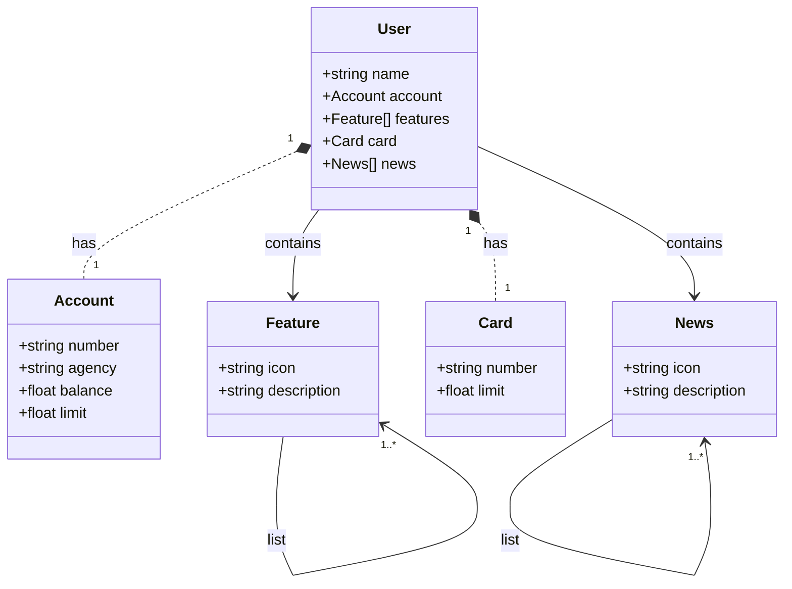

# Santander Dev Week (2023)
Java RESTful API para Santander Dev Week

## Diagram de classes

```mermaid
classDiagram
    class User {
        +string name
        +Account account
        +Feature[] features
        +Card card
        +News[] news
    }

    class Account {
        +string number
        +string agency
        +float balance
        +float limit
    }

    class Feature {
        +string icon
        +string description
    }

    class Card {
        +string number
        +float limit
    }

    class News {
        +string icon
        +string description
    }

    User "1" *.. "1" Account : has
    User --> Feature : contains
    User "1" *.. "1" Card : has
    User --> News : contains
    Feature --> "1..*" Feature : list
    News --> "1..*" News : list
```
